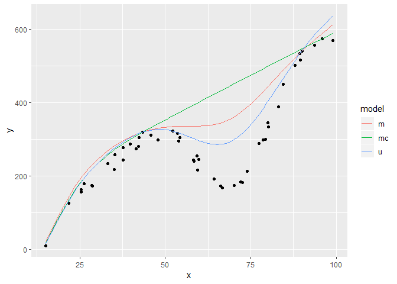
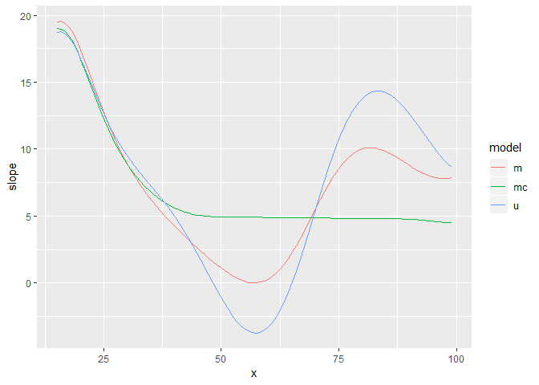
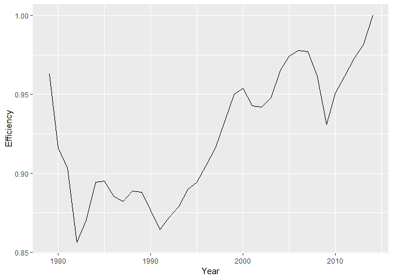
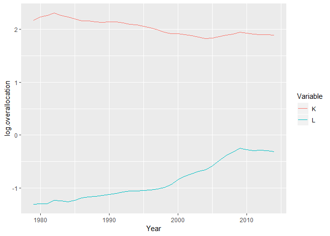

<!-- README.md is generated from README.Rmd. Please edit that file -->
snfa: Smooth Non-Parametric Frontier Analysis
=============================================

[](https://travis-ci.org/tkmckenzie/snfa)
[](https://cran.r-project.org/package=snfa)

Overview
========

Fitting of non-parametric production frontiers for use in efficiency analysis. Methods are provided for both a smooth analogue of Data Envelopment Analysis (DEA) and a non-parametric analogue of Stochastic Frontier Analysis (SFA). Frontiers are constructed for multiple inputs and a single output using constrained kernel smoothing as in Racine et al. (2009), which allow for the imposition of monotonicity and concavity constraints on the estimated frontier. Additional methods are provided to use constructed frontiers to estimate allocative efficiency, technical efficiency, and efficiency/productivity changes over time.

Installation
============

``` r
# The latest release version of snfa can be installed from CRAN:
install.packages("snfa")

# The development version of snfa can also be installed from github:
# install.packages("devtools")
devtools::install_github("tkmckenzie/snfa", build_opts = "--no-resave-data")
install.packages(c("ggplot2", "knitr", "lpSolve", "Rdpack", "rmarkdown")) # Install suggested packages
```

Usage
=====

snfa contains methods for estimating smooth frontiers and various types of efficiency. The best way to get an overview of the package and its motivation is to go through the vignette (currenlty only available in development version from github):

``` r
vignette("snfa")
```

It can also be helpful to look through examples (shown in Examples below):

``` r
example("fit.boundary")
example("allocative.efficiency")
```

Examples
========

Boundary fitting
----------------

``` r
example("fit.boundary", prompt.prefix = "")

> data(univariate)

> # Set up data for fitting
> X <- as.matrix(univariate$x)

> y <- univariate$y

> N.fit <- 100

> X.fit <- as.matrix(seq(min(X), max(X), length.out = N.fit))

> # Reflect data for fitting
> reflected.data <- reflect.data(X, y)

> X.eval <- reflected.data$X

> y.eval <- reflected.data$y

> # Fit frontiers
> frontier.u <- fit.boundary(X.eval, y.eval, 
+                            X.bounded = X, y.bounded = y,
+                            X.constrained = X.fit,
+                            X.fit = X.fit,
+                            method = "u")

> frontier.m <- fit.boundary(X.eval, y.eval, 
+                            X.bounded = X, y.bounded = y,
+                            X.constrained = X.fit,
+                            X.fit = X.fit,
+                            method = "m")

> frontier.mc <- fit.boundary(X.eval, y.eval, 
+                             X.bounded = X, y.bounded = y,
+                             X.constrained = X.fit,
+                             X.fit = X.fit,
+                             method = "mc")

> # Plot frontier
> library(ggplot2)

> frontier.df <- data.frame(x = rep(X.fit, times = 3),
+                           y = c(frontier.u$y.fit, frontier.m$y.fit, frontier.mc$y.fit),
+                           model = rep(c("u", "m", "mc"), each = N.fit))

> ggplot(univariate, aes(x, y)) +
+   geom_point() +
+   geom_line(data = frontier.df, aes(color = model))
```




    > # Plot slopes
    > slope.df <- data.frame(x = rep(X.fit, times = 3),
    +                        slope = c(frontier.u$gradient.fit,
    +                                  frontier.m$gradient.fit,
    +                                  frontier.mc$gradient.fit),
    +                        model = rep(c("u", "m", "mc"), each = N.fit))

    > ggplot(slope.df, aes(x, slope)) +
    +   geom_line(aes(color = model))



Allocative efficiency estimation
--------------------------------

``` r
example("allocative.efficiency", prompt.prefix = "")

> data(USMacro)

> USMacro <- USMacro[complete.cases(USMacro),]

> # Extract data
> X <- as.matrix(USMacro[,c("K", "L")])

> y <- USMacro$Y

> X.price <- as.matrix(USMacro[,c("K.price", "L.price")])

> y.price <- rep(1e9, nrow(USMacro)) #Price of $1 billion of output is $1 billion

> # Run model
> efficiency.model <- allocative.efficiency(X, y,
+                                           X.price, y.price,
+                                           X.constrained = X,
+                                           model = "br",
+                                           method = "mc")

> # Plot technical/allocative efficiency over time
> library(ggplot2)

> technical.df <- data.frame(Year = USMacro$Year,
+                            Efficiency = efficiency.model$technical.efficiency)

> ggplot(technical.df, aes(Year, Efficiency)) +
+   geom_line()
```




    > allocative.df <- data.frame(Year = rep(USMacro$Year, times = 2),
    +                             log.overallocation = c(efficiency.model$log.overallocation[,1],
    +                                                    efficiency.model$log.overallocation[,2]),
    +                             Variable = rep(c("K", "L"), each = nrow(USMacro)))

    > ggplot(allocative.df, aes(Year, log.overallocation)) +
    +   geom_line(aes(color = Variable))




    > # Estimate average overallocation across sample period
    > lm.model <- lm(log.overallocation ~ 0 + Variable, allocative.df)

    > summary(lm.model)

    Call:
    lm(formula = log.overallocation ~ 0 + Variable, data = allocative.df)

    Residuals:
         Min       1Q   Median       3Q      Max 
    -0.43704 -0.18195 -0.08572  0.14338  0.61385 

    Coefficients:
              Estimate Std. Error t value Pr(>|t|)    
    VariableK   2.0297     0.0465   43.65   <2e-16 ***
    VariableL  -0.8625     0.0465  -18.55   <2e-16 ***
    ---
    Signif. codes:  0 '***' 0.001 '**' 0.01 '*' 0.05 '.' 0.1 ' ' 1

    Residual standard error: 0.279 on 70 degrees of freedom
    Multiple R-squared:  0.9698,    Adjusted R-squared:  0.9689 
    F-statistic:  1124 on 2 and 70 DF,  p-value: < 2.2e-16

Getting help and reporting bugs
===============================

snfa is young and still under development. If you run into any issues or find any bugs, please email at <tkmckenzie@gmail.com>.
